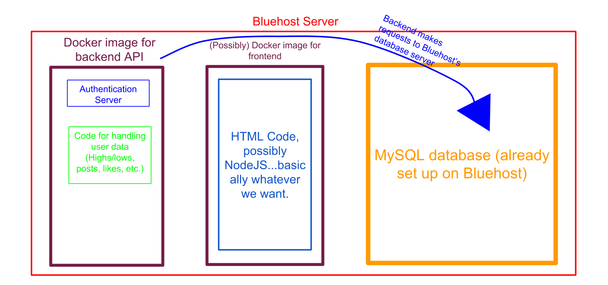

When I work out the kinks I will post instructions how to use this.


# Architecture
The architecture of the backend is based on the idea of __microservices__. Basically, any service we need (such as an API, computational engine, or frontend HTTP server) is contained in its own separate Docker image. This allows us to easily update, swap out and add to any of our services without breaking something. 

The overall current architecture of the server will be as such: 



Everything is contained within the Bluehost hosting server. Within this server, we will have a Docker image containing our API and other backend code (NOTE: This could be split up into backend code that is purely computational, and our API, if needed). This Docker image will __NOT__ include a MySQL server. Running a MySQL server inside a Docker image means that, if the Docker image needs to be udpated and re-built, we will lose all our MySQL data. Instead, we will simply use the built-in MySQL server on Bluehost. As an example with our Python code:

```
import MySQLdb

host = "Bluehost_server_IP_address" #This is Bluehost's server, rather than using 'localhost'
username = "Bluehost_server_username"
password = "Bluehost_server_password"
database = "Our_database_on_Bluehost_server"

connection = MySQLdb.connect(host, username, password, database)
```

This way, no matter what changes we make to the Docker image for the API, our users' data will stay intact!
